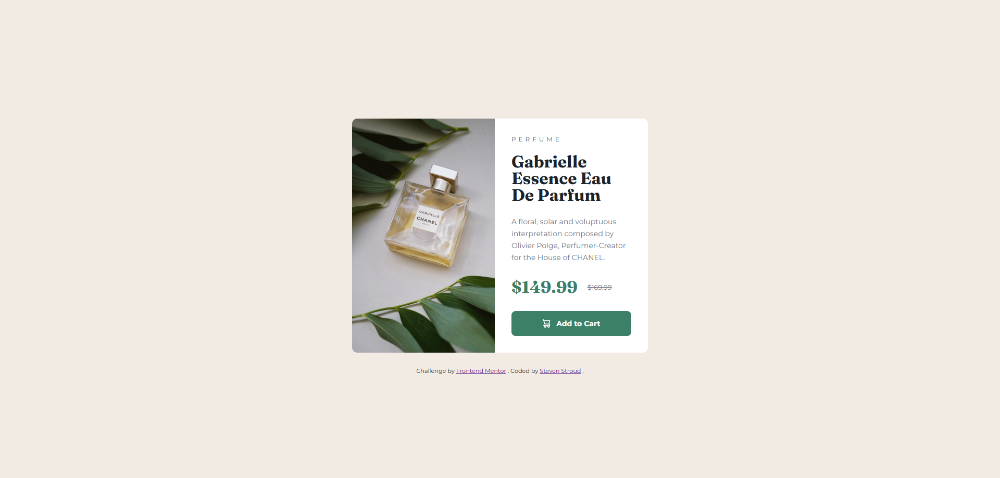

# Frontend Mentor - Product preview card component solution

This is a solution to the [Product preview card component challenge on Frontend Mentor](https://www.frontendmentor.io/challenges/product-preview-card-component-GO7UmttRfa). Frontend Mentor challenges help you improve your coding skills by building realistic projects. 

## Table of contents

- [Overview](#overview)
  - [The challenge](#the-challenge)
  - [Screenshot](#screenshot)
  - [Links](#links)
  - [Built with](#built-with)
  - [What I learned](#what-i-learned)
  - [Continued development](#continued-development)
  - [Useful resources](#useful-resources)
- [Author](#author)
- [Acknowledgments](#acknowledgments)

## Overview

### The challenge

Users should be able to:

- View the optimal layout depending on their device's screen size
- See hover and focus states for interactive elements

### Screenshot



### Links

- Solution URL: [Add solution URL here](https://your-solution-url.com)
- Live Site URL: [Add live site URL here](https://your-live-site-url.com)

## My process

### Built with

- Semantic HTML5 markup
- CSS custom properties
- Flexbox
- Mobile-first workflow

### What I learned

### Key Learnings

- **Fixing Layout Gaps:**  
  Use `display: block` for images to remove gaps caused by the default `inline` display.

- **Accessibility and Performance:**  
  Setting explicit `width` and `height` attributes on images helps with layout stability, though you chose not to focus on this right now.

- **Understanding Image Loading:**  
  `srcset` allows the browser to choose the best image based on its context but won't downgrade to a lower resolution once a higher resolution is loaded.

- **Control Over Image Loading:**  
  Use the `<picture>` element when you need precise control over which image is loaded at specific screen sizes.

By understanding these differences, you can make more informed choices about when to use `srcset` versus `<picture>`, and how to handle image display and performance in your projects.

New HTML symantic syntax used
```html
  <ins class="card__actual-price">$149.99</ins>
  <del class="card__old-price">$169.99</del>
```

### Continued development

### Areas to Focus On in Future Projects

1. **Image Display and Layout:**
   - Use `display: block` for images to prevent unwanted gaps and ensure proper alignment with other content.
   - Experiment with different display properties (e.g., `inline-block`, `flex`, `grid`) for desired layouts.

2. **Accessibility and Performance:**
   - Set explicit `width` and `height` attributes on images to improve layout stability and performance.
   - Use tools like Lighthouse to identify accessibility and performance improvements.

3. **Responsive Image Techniques:**
   - Understand when to use `srcset` and `<picture>` for responsive images.
   - Use `srcset` for optimizing image loading based on resolution and `<picture>` for precise control over images at different viewport sizes.

4. **Optimizing Image Loading:**
   - Learn techniques for optimizing images, such as lazy loading, next-gen formats (WebP, AVIF), and compression.
   - Explore caching strategies to improve loading times, especially for slower connections.

5. **Understanding Browser Behavior:**
   - Study how browsers choose which images to load and their caching strategies.
   - Adjust image-loading strategies to save bandwidth while maintaining quality.

6. **Testing and Optimization:**
   - Regularly test your website on different devices to ensure consistent image loading and user experience.
   - Use performance monitoring tools to identify and address bottlenecks.

By focusing on these areas, you can create more efficient, accessible, and visually appealing web projects.


### Useful resources

- [PX to Rem calculator](https://nekocalc.com/px-to-rem-converter)
- [HEX colors to HSL conversion](https://htmlcolors.com/hex-to-hsl#google_vignette)


## Author

- Frontend Mentor - [@Stroudy](https://www.frontendmentor.io/profile/Stroudy)
- Twitter - [@StroudCoder](https://x.com/StroudCoder)

## Acknowledgments
Would love to acknowledge that [@Grace-Snow](https://fedmentor.dev/) from fontend mentor discord for sharing her knowledge and guiding me in my journey
